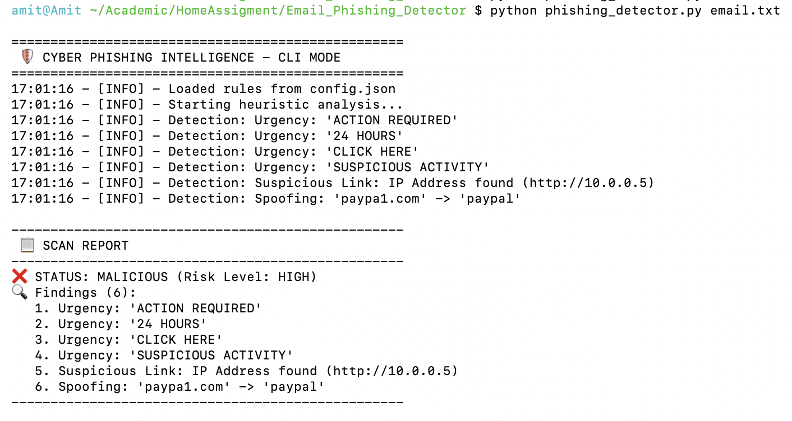
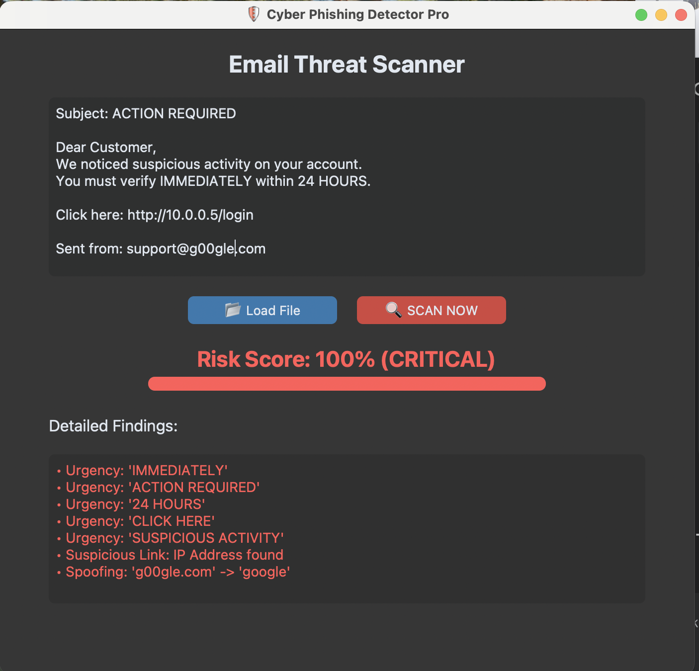
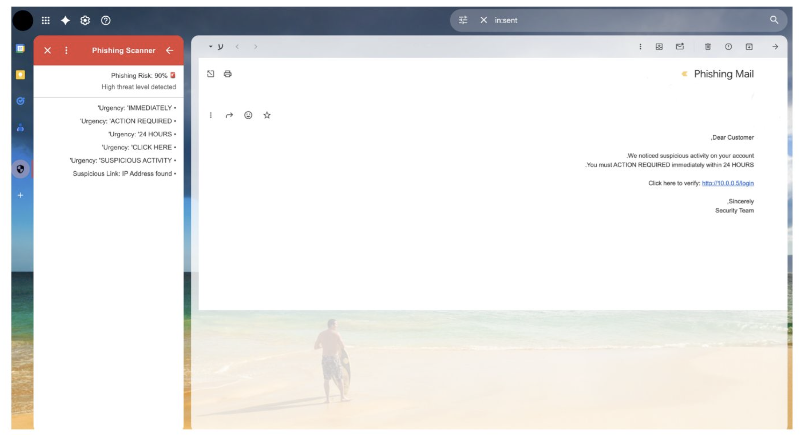

# 🛡️ Phishing Email Intelligence Engine 

A comprehensive cybersecurity tool designed to scan email content for social engineering indicators, brand impersonation (typosquatting), and malicious network artifacts.

This project features a **hybrid architecture** with a local detection engine, a desktop GUI, and a cloud-deployed API integrated directly into Gmail.

## 🚀 Key Features

* **Core Logic Engine:** An extensible detection system built using OOP principles and Regex heuristics.
* **CLI Mode:** Quick analysis of text files via the command line.
* **Desktop Dashboard:** A modern graphical user interface (GUI) built with `CustomTkinter` for easy manual scanning.
* **Gmail Integration:** A fully functional Google Workspace Add-on that scans emails directly within the inbox, powered by a cloud-deployed REST API (PythonAnywhere).
* **Dynamic Configuration:** Detection rules and threat intelligence (keywords, protected brands) are managed via `config.json` without code changes.

## 🛠️ Tech Stack

* **Language:** Python 3.10+
* **GUI:** CustomTkinter
* **Backend:** Flask (RESTful API)
* **Cloud Deployment:** PythonAnywhere (WSGI)
* **Integration:** Google Apps Script

## 📂 Project Structure
```text
Email_Phishing_Detector/
│
├── phishing_detector.py   # Core Logic + CLI Mode (The Engine)
├── phishing_ui.py         # Desktop GUI 
├── flask_app.py           # Flask Server for Cloud API 
├── config.json            # Dynamic Rules & Threat Intelligence
├── email.txt              # Sample malicious email for testing
├── requirements.txt       # Project dependencies
├── README.md              # Documentation
│
└── gmail_addon/           # Source code for Google Workspace Integration
    ├── code.gs            # Google Apps Script logic
    └── appsscript.json    # Manifest configuration
```

## ⚙️ Installation
Clone the repository / Extract files.

Install dependencies:

pip install -r requirements.txt

## 🏃‍♂️ Usage Modes

# Mode A: Command Line Interface (CLI)
Run the script directly with a text file as an argument to get a terminal report:

python phishing_detector.py email.txt

<details>
<summary>📸 <strong>Click to expand: View Command Line Interface</strong></summary>



</details>

# Mode B: Desktop Dashboard (GUI)
Launch the visual scanner to paste text or load files interactively:

python phishing_ui.py

<details>
<summary>📸 <strong>Click to expand: View Desktop UI</strong></summary>




</details>

# Mode C: Gmail Integration (Cloud API)
The project includes a server (flask_app.py) designed to run on a cloud provider (e.g., PythonAnywhere):

Backend: The Flask server listens for POST requests containing email bodies.

Frontend: The Google Apps Script (gmail_addon/code.gs) fetches the email content and sends it to the cloud API.

Result: The Add-on displays a sidebar in Gmail with a "Risk Score" and detailed findings.

<details>
<summary>📸 <strong>Click to expand: View Gmail Integration</strong></summary>



</details>

## 🛡️ Detection Logic & Threat Intelligence
The scanner utilizes a hybrid detection engine based on cyber threat intelligence research regarding financial phishing campaigns. 
The engine scans for three primary attack vectors:

1. Psychological Urgency (Social Engineering)
Logic: Scans for high-pressure language designed to bypass critical thinking and force immediate user action.
Indicators: "IMMEDIATE ACTION REQUIRED", "24 HOURS", "ACCOUNT SUSPENDED".
Configuration: Keywords are fully customizable via config.json.

2. Network Anomalies (IP Links)
Logic: Identifies URLs containing raw IP addresses (e.g., http://10.0.0.5) instead of legitimate domain names.
Significance: A strong indicator of malicious hosting, direct-to-IP attacks, or attempts to bypass DNS-based filters.

3. Brand Impersonation (Typosquatting)
Logic: Detects domains that mimic trusted brands using character substitution (Homograph attacks).
Normalization Engine: The script normalizes characters (e.g., converting 1 to l, @ to a, 0 to o) to detect obfuscated spoofing.
Example: paypa1.com is detected as a spoof of paypal.com.
Coverage: Protects against spoofing of top global targets including PayPal, Google, Apple, and major banks (Chase, Wells Fargo).

